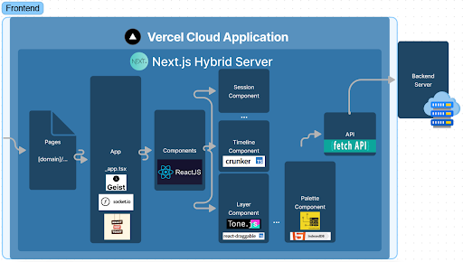

# hhub-backend Documentation

## Design Documentation

Last Update: 4/30/2022

I. Context and Scope

    This application serves as the frontend server for the Harmony Hub frontend application. The application should be run locally for testing and development purposes, and deployed to Vercel for production releases. The potential for this code base is huge and any additions to it are welcome.

II. Goals

    Thie goal of this application is to create a web app where users can have an fun and stree-free experience making music together. The goal was not to recreate the expensive and complex Digital Audio Workstations (DAWs); rather, the goal was quite the opposite. This app provides users an extremely simple digital-music-making oppurtunity.

III. Software Architecture

IV. File Layout

    📦hhub
    ┣ 📂api
    ┃ ┣ 📜Helper.tsx
    ┃ ┣ 📜InitSockets.ts
    ┃ ┣ 📜Session.tsx
    ┃ ┗ 📜Song.tsx
    ┣ 📂components
    ┃ ┣ 📂animations
    ┃ ┃ ┣ 📜Animation.tsx
    ┃ ┃ ┣ 📜AnimationPic.tsx
    ┃ ┃ ┗ 📜Wave.tsx
    ┃ ┣ 📂helpers
    ┃ ┃ ┣ 📜indexedDb.ts
    ┃ ┃ ┗ 📜resize.ts
    ┃ ┣ 📂palette
    ┃ ┃ ┣ 📜Palette-Cell.tsx
    ┃ ┃ ┣ 📜Palette-Layer.tsx
    ┃ ┃ ┣ 📜Palette-Recorder.tsx
    ┃ ┃ ┗ 📜Palette.tsx
    ┃ ┣ 📂sessions
    ┃ ┃ ┣ 📜ComittedLayer.tsx
    ┃ ┃ ┣ 📜Crunker.tsx
    ┃ ┃ ┣ 📜End.tsx
    ┃ ┃ ┣ 📜Session.tsx
    ┃ ┃ ┣ 📜SessionInfo.tsx
    ┃ ┃ ┣ 📜SessionOptions.tsx
    ┃ ┃ ┣ 📜StagedLayer.tsx
    ┃ ┃ ┗ 📜Timeline.tsx
    ┃ ┣ 📜config.ts
    ┃ ┗ 📜Navbar.tsx
    ┣ 📂context
    ┃ ┣ 📜member.ts
    ┃ ┗ 📜socket.ts
    ┣ 📂interfaces
    ┃ ┣ 📂models
    ┃ ┃ ┣ 📜Genre.ts
    ┃ ┃ ┣ 📜LayerInterface.ts
    ┃ ┃ ┣ 📜Member.ts
    ┃ ┃ ┣ 📜Queue.ts
    ┃ ┃ ┣ 📜SessionInterface.ts
    ┃ ┃ ┗ 📜SongInterface.ts
    ┃ ┣ 📂socket-data
    ┃ ┃ ┣ 📜layers_created.ts
    ┃ ┃ ┗ 📜session_made.ts
    ┃ ┣ 📜authResponse.ts
    ┃ ┗ 📜StagedLayerInterface.ts
    ┣ 📂pages
    ┃ ┣ 📂sessions
    ┃ ┃ ┗ 📜[sessionId].tsx
    ┃ ┣ 📜index.tsx
    ┃ ┣ 📜learn.tsx
    ┃ ┣ 📜library.tsx
    ┃ ┣ 📜login.tsx
    ┃ ┣ 📜logout.tsx
    ┃ ┣ 📜profile.tsx
    ┃ ┣ 📜queue.tsx
    ┃ ┣ 📜signup.tsx
    ┃ ┣ 📜tutorial.tsx
    ┃ ┗ 📜_app.tsx
    ┣ 📂public
    ┃ ┣ 📂images
    ┃ ┃ ┣ 📜black_wave.svg
    ┃ ┃ ┣ 📜dot-grid.svg
    ┃ ┃ ┣ 📜grey_wave.svg
    ┃ ┃ ┣ 📜music-bars.svg
    ┃ ┃ ┣ 📜profile-avatar.webp
    ┃ ┃ ┣ 📜re-order-dots.svg
    ┃ ┃ ┗ 📜wave.svg
    ┃ ┣ 📜A-major-high.mp3
    ┃ ┣ 📜A-major-low.mp3
    ┃ ┣ ...
    ┃ ┗ 📜vercel.svg
    ┣ 📂styles
    ┃ ┣ 📜style.scss
    ┃ ┣ 📜_home.scss
    ┃ ┣ 📜_intro.scss
    ┃ ┣ 📜_learn.scss
    ┃ ┣ 📜_queue.scss
    ┃ ┗ 📜_tutorial.scss
    ┣ 📜.env.local
    ┣ 📜.eslintrc.json
    ┣ 📜.gitignore
    ┣ 📜architecture.png
    ┣ 📜Documentation.md
    ┣ 📜next-env.d.ts
    ┣ 📜next.config.js
    ┣ 📜package-lock.json
    ┣ 📜package.json
    ┣ 📜README.md
    ┣ 📜README.pdf
    ┣ 📜tsconfig.json
    ┗ 📜yarn.lock

V. File and Directory Descriptions:

- api

    This directory holds the files containing the logic to connect to the REST API on the backend. Functions are both 'async' and 'sync' to provide developers functionality for all situtations.

- components

    This directory contains the most complex aspect of our application. The majority of files are React Class Components which encompass the advanced features in our app such as draggable sound layers, the DAW, the adjustable timeline, and more. Adding features or bug fixes will likely fall into the code in this directory.

- context

    This directory contains the React contexts needed in our application. The current contexts held are the socket client instance and the member information. By maintaining these contexts, our app does not have to reconnect and re-query this data respectfully on each page change.

- interfaces

    This directory contains the custom typescript interfaces used in our app.

- pages

    This folder contains all the html routes in our app. For example, if the user visits 'https://harmonyhub.vercel.app/library' in their browser, they will see the rendering of 'pages/queue.tsx'.

- public

    This folder contains the static files used in the browser including images and pre-recorded sounds.

- styles

    This folder contains the 'scss' stylesheets that make our app look so great!

## API Specification

No API specification needed for the frontend.

See our <a href="https://documenter.getpostman.com/view/17281246/UyrGBZh7" target="_blank">Postman API Documentation</a> for our backend API specification.

## README

See our [README](README.md)

The README contains information concerning installation and start-up procedures.

## Contribution Guide

I. Rules

    Any additions to this code base should be appropriate and rated PG. Additions should also align with the goals of our application (stated in the 'Goals' section). In summary, additions should keep our app simple and fun for the user. Unnecessarily complex features will be denied.

II. How to Contribute

    1. Create a Github Issue requesting access and a few sentences concerning your feature idea or bug fix.

    2. Once access is granted, create a descriptive feature branch.

    3. Develop

    4. Once your work is complete, create a PR into the 'test' branch. When accepted, the unit testing suite will be executed and a test build will be started on Vercel. Upon these both passing, the 'test' branch will then be merged into 'master'.